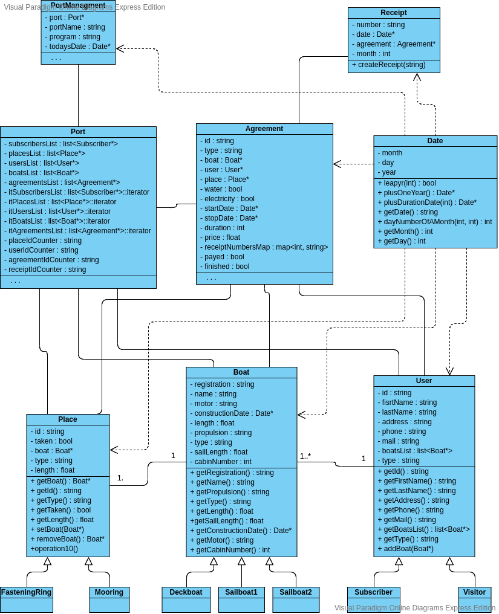
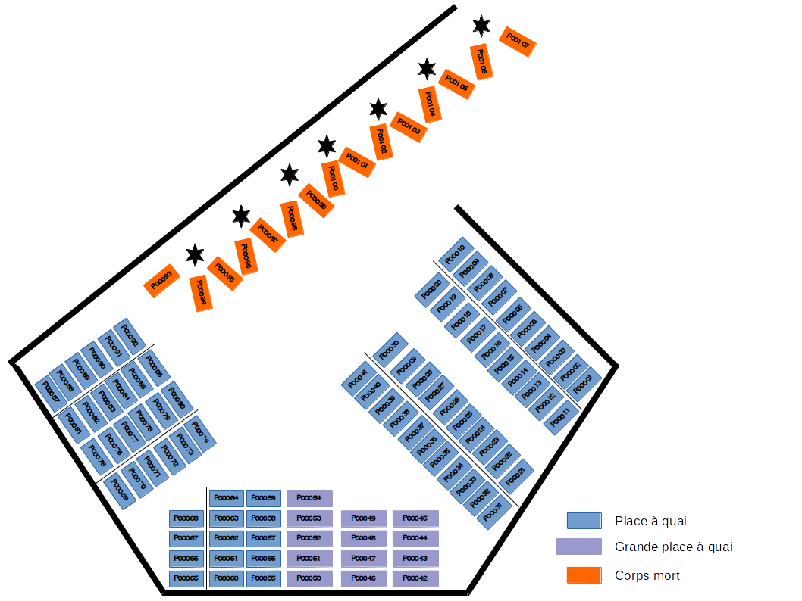

# "Les Minimes en un clic" Application

  

This application responds to the OPP project given in the "UE POO", in M1 Bioinformatics of the University of Bordeaux. It permits the management of the maritim port "Les Minimes", based in La Rochelle (France).


*Version française en italique*  
*Cette application répond au projet de POO donné au sein de l'UE POO du M1 Bioinformatique de l'Université de Bordeaux. Il permet la gestion du port maritime "Les Minimes", situé à La Rochelle.*
  

### Autor (*Auteur*)

> Mathieu BOLTEAU  
> mathieu.bolteau1@gmail.com  
> GitHub : @mablt  

  
### Installation

  

`git clone https://github.com/mablt/LesMinimesEnUnClic_Application.git`  
`cd LesMinimesEnUnClic_Application/`
 

### Class Diagram (*Diagramme de Classes*)  




### Test

The port's map imagined for this data test is as follows :  
*Le plan du port imaginé pour ce jeu de données test est le suivant :*

  


Run the test  
*Lancement du test*


`cd src/`  
`make clean`  
`make`  
`./LesMinimesEnUnClic`

  
The program ask the today's date first :  
*Le programme demande la date du jour dans un premier temps :*

``` 
### Les Minimes's Port ###

  

Give the today's date  
Indicate the date (mmddyyyy or mm/dd/yyyy)  
>>> 
```

  
Give the date : `04/01/2020`  
*Donnez la date :  `04/01/2020`*  

Then, load the files contains the data :  
*Ensuite, chargez les fichiers contenant les données :*


``` 
>>>Load Data<<<

Give the file contains Boats' data :  
>>> ./../test/boats.txt  
File loaded.  
Give the file contains Places' data :  
>>> ./../test/places.txt  
File loaded.   
Give the file contains Users' data :  
>>> ./../test/users.txt  
File loaded.  
Give the file contains Agreements' data :  
>>> ./../test/agreements.txt  
File loaded.  
```

  

After, the program is display like that :  
*Puis, le menu est affiché comme ceci :*


``` 
### Les Minimes's Port ###
 

1. User input.  
2. Boat input  
3. Agreement creation.  
4. Get available places.  
5. Put an agreement to payed.  
6. Edit receipts of the day.  
7. Re-edit an old receipt.  
  

0. Quit  
>>> 
```

  

First, edit the today's receipt with the choice `6`.  
*Tout d'abord, éditez les factures du jour avec le choix `6`.*


```
>>> 6

Please, give the foler's path to stock the receipts.  
>>> ./../test/  
Receipts creation done.  
```

  

The second step is the re-edition of some old receipt.  
*La deuxième étape est la ré-édition d'anciennes factures.*


```
>>> 7  
Give the foler's path to stock the receipts.  
>>> ./../test/  
Give the user ID.  
>>> U00011  
Receipt creation done.  
```

  

```
>>> 7  
Give the foler's path to stock the receipts.  
>>> ./../test/  
Give the user ID.  
>>> U00005  
Give the month of the receipt.  
>>> 1  
Receipt creation done.  
```

  

Then, show the available places :  
*Après, affichez les places disponibles :*  

```
>>> 4  
P00007 : FasteningRing Place 20 m.  
P00010 : FasteningRing Place 20 m.   
P00014 : FasteningRing Place 22.5 m.  
P00015 : FasteningRing Place 22.5 m.  
P00016 : FasteningRing Place 22.5 m.    

[ . . .]    

P00083 : FasteningRing Place 20 m.  
P00084 : FasteningRing Place 20 m.  
P00090 : FasteningRing Place 24 m.  
P00091 : FasteningRing Place 24 m.  
P00092 : FasteningRing Place 24 m.  
P00097 : Mooring Place  
P00098 : Mooring Place    
P00099 : Mooring Place  
P00100 : Mooring Place  
P00101 : Mooring Place  
P00102 : Mooring Place  
P00103 : Mooring Place  
P00104 : Mooring Place  
```

Then, create a boat and attribute this boat to a pre-existant subscriber ('U00033').  
*Puis, créez un bateau et attribuez-le à un abonné pré-existant ('U00033').*  

```
>>> 2  
Boat Registration :  
>>> IO H76545  
Boat Name :  
>>> LA MOUETTE  
Boat Motor informations:  
>>> Evinrude ETEC G2 K115 L H.O.  
Boat Construction Date :  
Indicate the date (mmddyyyy or mm/dd/yyyy)  
>>> 03/09/2001  
Boat Type ('Deckboat', 'Sailboat1' or 'Sailboat2') :  
>>> Sailboat1  
Boat Length (in m.) :  
>>> 14  
Sail length (in m.) :  
>>> 15  
Cabin number :  
>>> 1  
Already existing user ('yes' or 'no') :  
>>> yes  
Give the user id :  
>>> U00033  
Boat created.  
```

  

Create now an agreement for this user. **The start date must be the today's date.**  
*Créez maintenant un contrat pour cet usager. __La date de début doit être la date du jour.__*

```
>>> 3  
Start date of the agreement :  
Indicate the date (mmddyyyy or mm/dd/yyyy)  
>>> 04/01/2020  
Boat Registration :  
>>> IO H76545  
Place Id :  
>>> P00033  
User Id :  
>>> U00033  
```

  

The last option to test is the user creation :  
*La dernière option a tester est la création d'usager :*  

```
>>> 1  
Fisrt Name :  
>>> John  
Last Name :  
>>> Smith  
Address :  
>>> 11 rue de l'église  
Phone :  
>>> 0123456789  
Mail :  
>>> j.smith@mail.com  
Type ('Subscriber' or 'Visitor'):  
>>> Visitor  
Already existing boat ('yes' or 'no') :  
>>> yes  
Boat Registration :  
>>> LR B68933  
Boat added to the user.  
```

  

Create an agreement with the visitor just created :  
*Créez un contrat avec le visiteur juste créé :*  

```
>>> 3  
Start date of the agreement :  
Indicate the date (mmddyyyy or mm/dd/yyyy)  
>>> 04/01/2020  
Boat Registration :  
>>> LR B68933  
Place Id :   
>>> P00035  
User Id :  
>>> U00048  
Water desired : ('yes' or 'no)  
>>> yes  
Electricity desired : ('yes' or 'no)  
>>> yes  
Duration of the stay :  
>>> 3  
```

  

Close the application and save data :  
*Fermez l'application et sauvegardez les données :*  

``` 
>>> 0  
Do you want to quit ?  
Press '0' to confirm or any key to cancel.  
>>> 0  
>>>Save data<<<  
Give the file name to save Boats' data :  
>>> ./../test/boats.txt  
Boats data saved.  
Give the file name to save Places' data :  
>>> ./../test/places.txt  
Places data saved.  
Give the file name to save Users' data :  
>>> ./../test/users.txt  
Users data saved.  
Give the file name to save Agreements' data :  
>>> ./../test/agreements.txt  
Agreements data saved.  
```

  

Re-open the application and load the files which contains the data (created before) :  
*Ré-ouvrez l'application et chargez les fichiers qui contiennent les données (créés juste avant) :*

``` 
### Les Minimes's Port ###  
  

Give the today's date  
Indicate the date (mmddyyyy or mm/dd/yyyy)  
>>>  
```    

Give the date : `04/03/2020`, to simulate 2 days later.  
*Donnez la date : `04/03/2020`, pour simuler une date 2 jours après.*  
  

Then, load the files contains the data :  
*Puis, chargez les fichiers contenant les données:*  

```
 >>>Load Data<<<  
Give the file contains Boats' data :  
>>> ./../test/boats.txt  
File loaded.  
Give the file contains Places' data :  
>>> ./../test/boats.txt  
File loaded.  
Give the file contains Users' data :  
>>> ./../test/boats.txt  
File loaded.  
Give the file contains Agreements' data :  
>>> ./../test/agreements.txt  
File loaded.  
```

  

After, choose the option `6`:  
*Ensuite, choisissez l'option `6`:*

```
>>> 6  
Please, give the foler's path to stock the receipts.  
>>> ./test/  
Receipts creation done.  
```

Look at the folder `test/`. The receipt of the last agreement is created.  
*Regardez dans le dossier `test/`. La facture du dernier contrat a été créée.*  

Now, work well ! :)  
*Maintenant, travaillez bien ! :)*